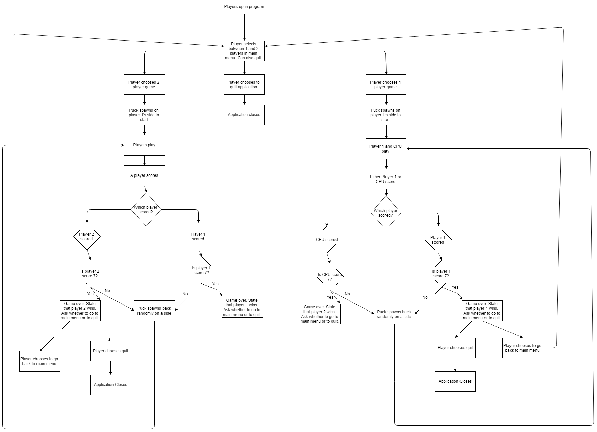

# Final
 
# Pong Hockey 

<h3>Project </h3>
This project is a mash-up of the two classic games of Pong and Air Hockey. Our game has a 2 player mode and a 1 player with CPU opponent mode. From the main menu, you can select which mode you'd like to play. After every collision of the puck, its speed will either increase or decrease. After every score, the speed will reset to what is was originally. You control Player 1 with the WASD keys and Player 2 with the arrow keys. 

<h4> Flowchart <h4>
  

<h3> Screenshots</h3>

 
 
<h3> Installing</h3>
 

* Instructions on how to install or download the program. 

* Click the download zip button and extract the file to a location that you determine. 

* Open the .exe file through the file location Final/Final/Final/bin/Debug.

<h3> Built With</h3>

* This project was built entirely with Visual Studio 2017 through Windows Form.

<h3>Contributing</h3>

* If have any questions about this project, you can email nicknahnybida@gmail.com 

<h3>Authors</h3>

* Nicholas Nahnybida @Nick-Nahnybida
* Sam Olsen @Olsen031
* Fahim Fnu @ff315427

<h3>License</h3>

* This project is licensed under the MIT License - see the [LICENSE.md](LICENSE.md) file for details

<h3>Acknowledgments</h3>

* Thanks to the many C# resources available, Stack Overflow, and our teacher John Brosius @JohnBrosius
