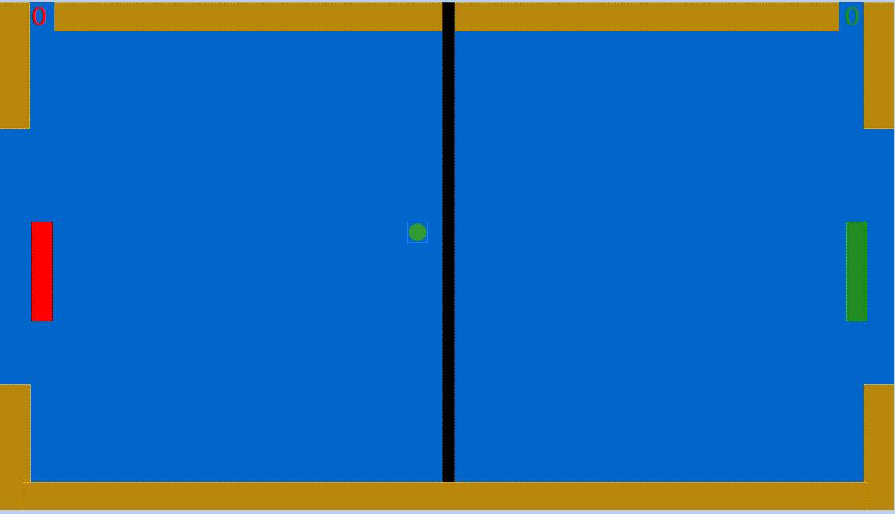
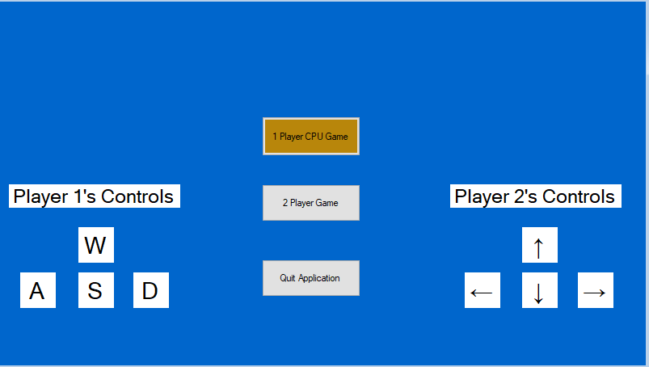
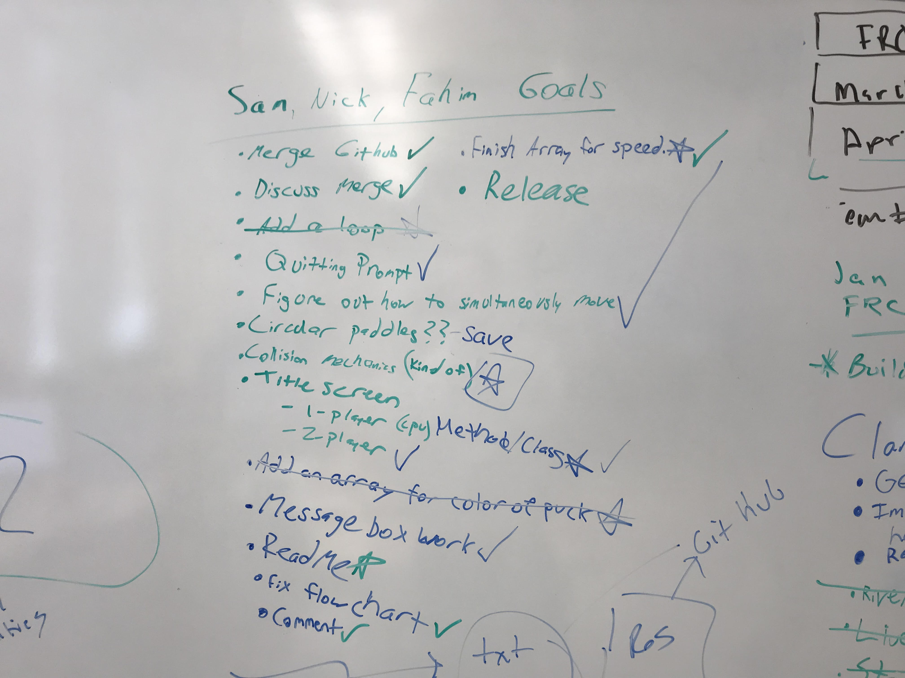

# Pong Hockey 

<h3>Project </h3>
This project is a mash-up of the two classic games of Pong and Air Hockey. Our game has a 2 player mode and a 1 player with CPU opponent mode. From the main menu, you can select which mode you'd like to play. After every collision of the puck, its speed will either increase or decrease. After every score, the speed will reset to what is was originally. You control Player 1 with the WASD keys and Player 2 with the arrow keys. 

<h4> Youtube Videos <h4>
  <h2> To view the 1 player mode click here: https://youtu.be/zUKRvF2IWrs </h2>
 
  <h2> To view the 2 player mode click here: https://youtu.be/eQlDBePWl-E </h2>
  
  <a href="https://youtu.be/zUKRvF2IWrs" The 1 player mode </a>
  <a href="https://youtu.be/eQlDBePWl-E" The 2 player mode </a>

  
<h4> Flowchart <h4>
  

<h3> Screenshots</h3>
 

<h3> Installing</h3>

* Instructions on how to install or download the program. 

* Click this link, then click the most recent release's .exe file. https://github.com/CSharpTerm2GroupFinalProject/Final/releases

* Keep the file, then click "more info," then the "run anyway" button.

* Enjoy!

<h3> Word of Warning</h3>
<h5> If the .exe file won't open after it has been previously opened </h5>
  
  * After opening and closing the .exe file, you may need to open the task manager and end the "Final (32-bit)" task. For some reason it stays open even after being closed by the user. We are actively looking into this issue now.
  

  
<h3> Our Standing Meetings at every day </h3>
 
  
    

<h3> Built With</h3>

* This project was built entirely with Visual Studio 2017 through Windows Form.

<h3>Contributing</h3>

* If have any questions about this project, you can email nicknahnybida@gmail.com 

<h3>Authors</h3>

* Nicholas Nahnybida @Nick-Nahnybida
* Sam Olsen @Olsen031
* Fahim Fnu @ff315427

<h3>License</h3>

* This project is licensed under the MIT License

<h3>Acknowledgments</h3>

* Thanks to the many C# resources available, Stack Overflow, and our teacher John Brosius @JohnBrosius
